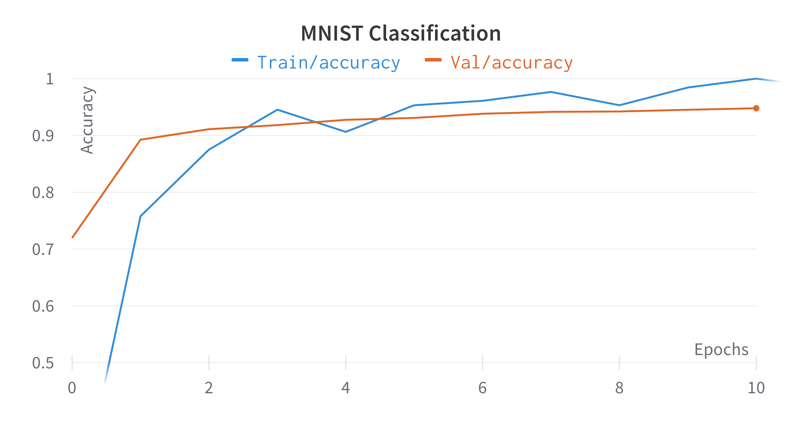
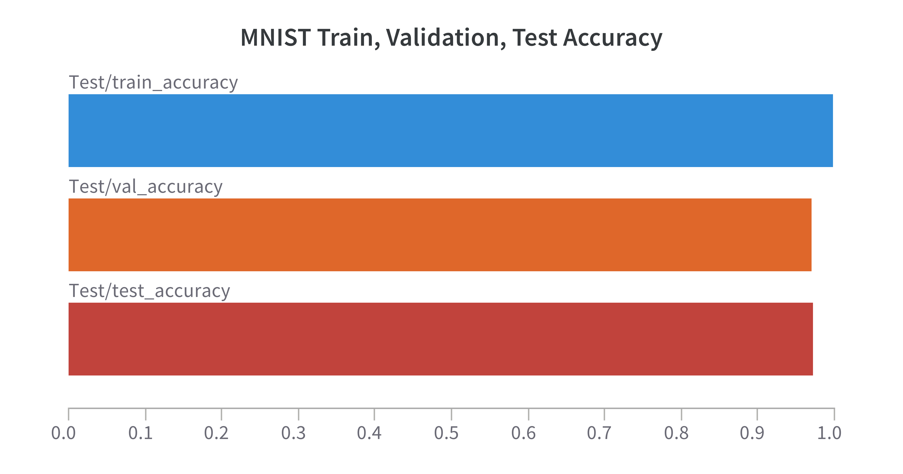
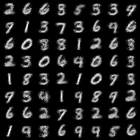

# Simple EinsumNetworks Implementation

This repository contains code for my personal, simplistic, EinsumNetworks implementation.

For a speed benchmark comparison against the official EinsumNetworks implementation, check out [benchmark.md](./benchmark/benchmark.md) (short: simple-einet is faster in all dimensions except the input-channel size but scales similar to EinsumNetworks).

# PyTorch Lightning Training

The `main_pl.py` script offers PyTorch-Lightning based training for discriminative and generative Einets.

Classification on MNIST examples:

```sh
python main_pl.py dataset=mnist D=5 I=25 R=10 S=25 lr=0.01 dist=normal epochs=100 classification=True batch_size=1024
```





Generative learning on MNIST:

``` sh
python main_pl.py dataset=mnist D=3 I=10 R=1 S=10 lr=0.1 dist=binomial epochs=10 batch_size=128
```



## Installation

```shell
git clone git@github.com:steven-lang/simple-einet.git
cd simple-einet
pip install .

# Or if you plan to edit the files after installation:
pip install -e .
```

## Usage Example

```python

import torch
from simple_einet.clipper import DistributionClipper
from simple_einet.distributions import RatNormal
from simple_einet.einet import Einet
from simple_einet.einet import EinetConfig

torch.manual_seed(0)

# Input dimensions
in_features = 4
batchsize = 5
out_features = 3

# Create input sample
x = torch.randn(batchsize, in_features)

# Construct Einet
einet = Einet(EinetConfig(in_features=in_features, D=2, S=2, I=2, R=3, C=out_features, dropout=0.0, leaf_base_class=RatNormal, leaf_base_kwargs={"min_sigma": 1e-5, "max_sigma": 1.0},))

# Compute log-likelihoods
lls = einet(x)
print(f"lls={lls}")
print(f"lls.shape={lls.shape}")

# Optimize Einet parameters (weights and leaf params)
optim = torch.optim.Adam(einet.parameters(), lr=0.001)

for _ in range(1000):
    optim.zero_grad()

    # Forward pass: compute log-likelihoods
    lls = einet(x)

    # Backprop negative log-likelihood loss
    nlls = -1 * lls.sum()
    nlls.backward()

    # Update weights
    optim.step()

# Construct samples
samples = einet.sample(2)
print(f"samples={samples}")
print(f"samples.shape={samples.shape}")
```

## Citing EinsumNetworks

If you use EinsumNetworks in your publications, please cite the official EinsumNetworks paper.

```bibtex
@inproceedings{pmlr-v119-peharz20a,
  title = {Einsum Networks: Fast and Scalable Learning of Tractable Probabilistic Circuits},
  author = {Peharz, Robert and Lang, Steven and Vergari, Antonio and Stelzner, Karl and Molina, Alejandro and Trapp, Martin and Van Den Broeck, Guy and Kersting, Kristian and Ghahramani, Zoubin},
  booktitle = {Proceedings of the 37th International Conference on Machine Learning},
  pages = {7563--7574},
  year = {2020},
  editor = {III, Hal Daumé and Singh, Aarti},
  volume = {119},
  series = {Proceedings of Machine Learning Research},
  month = {13--18 Jul},
  publisher = {PMLR},
  pdf = {http://proceedings.mlr.press/v119/peharz20a/peharz20a.pdf},
  url = {http://proceedings.mlr.press/v119/peharz20a.html},
  code = {https://github.com/cambridge-mlg/EinsumNetworks},
}
```

If you use this software, please cite it as below.

``` bibtex
@software{braun2021simple-einet,
author = {Braun, Steven},
title = {{Simple-einet: An EinsumNetworks Implementation}},
url = {https://github.com/braun-steven/simple-einet},
version = {0.0.1},
}
```
